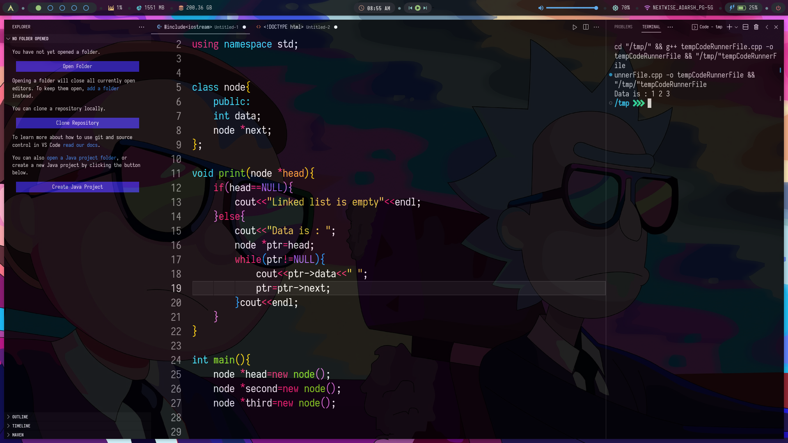

 <pre><h2>             This repo contains the config files of vscode text editor</h2></pre>

<h3><pre>      In addition to the json file and the keybinding, the various extensions that I use are also listed <pre></h3>
You can copy the same config files to make your vs code look something like: 

